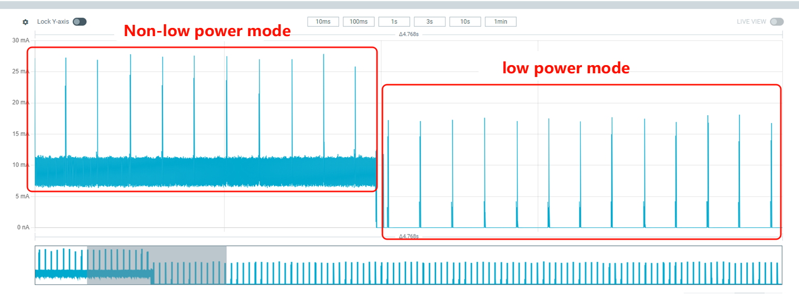

# ADV Scenario
1. Open a serial debug tool, connect to the HCPU console port, and hook up the measurement device to the DUT.
2. After the board boots successfully, the log appears as shown in [the figure](adv_log). At this time, keep the wake-up pin floating or low; otherwise it will enter sleep right after boot.

```{image} assert/image5.png
:name: adv_log
```

3. The default ADV interval after startup is 200 ms. Inquiry Scan and Page Scan are also enabled automatically. To measure BLE power, disable scans using `btskey` commands (see BT Scan section). For example, send `btskey s`; if the menu shows you are at the main page, send the following commands to disable Page Scan and Inquiry Scan. After `btskey 0`, you can send `btskey 4` to query scan status.
```
(a) btskey 1
(b) btskey 7
(c) btskey 0
```
4. Pull the wake-up pin high to enter low-power mode; the current drops noticeably as shown below. Measure current at the 200 ms interval. In low-power mode, see the waveform at ADV=200 ms. Record 10 s average current as C1, sleep current between two peaks as C2, and compute ADV incremental current as C=C1−C2.

<div align="center"><strong>Current change when entering low-power mode</strong></div>


<div align="center"><strong>Current waveform at ADV = 200 ms</strong></div>

5. Pull the wake-up pin low to exit low-power mode, and send `ble_config adv 500` in the console to change ADV interval to 500 ms.
6. Pull the wake-up pin high again to enter low-power mode and measure current at 500 ms interval.

Repeat steps 5 and 6 to measure current at ADV intervals of 50 ms, 100 ms, 500 ms, and 1000 ms.