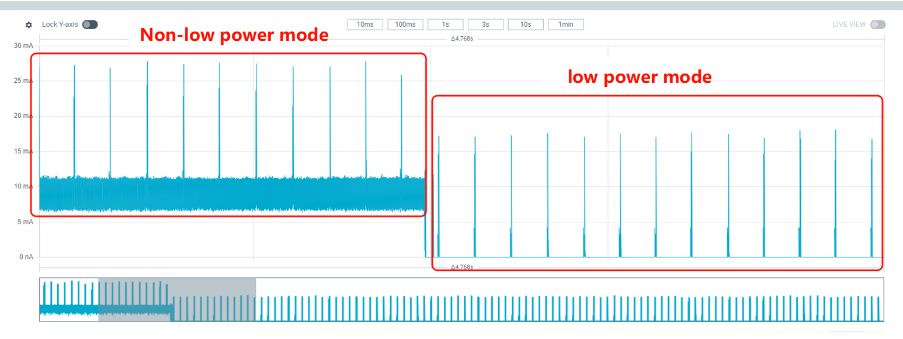
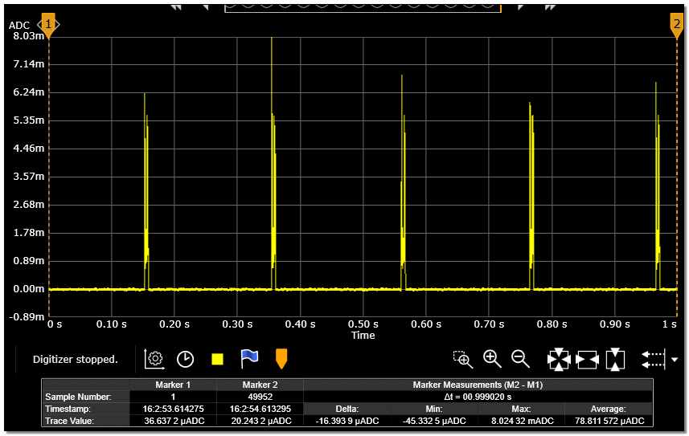
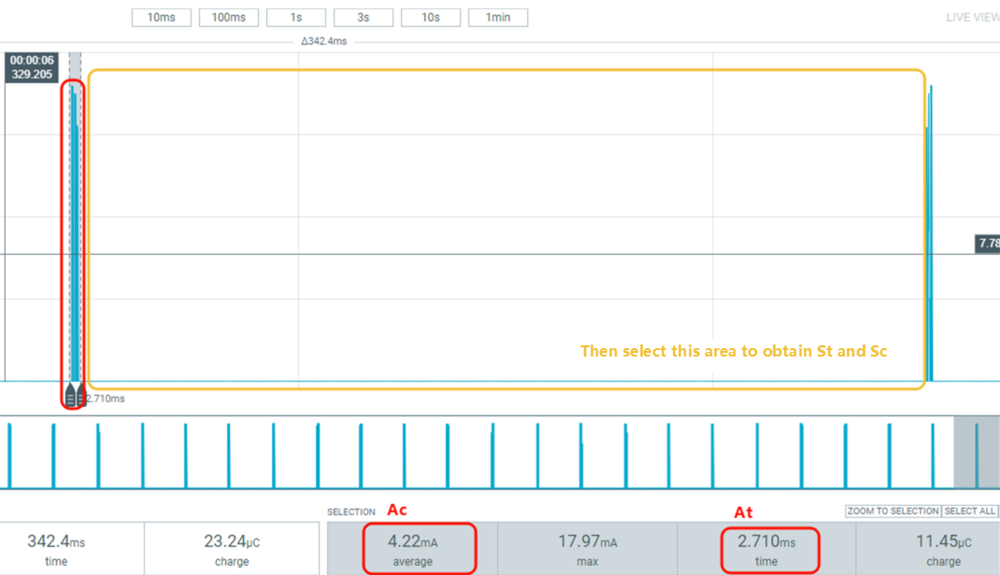

# ADV Scenario
1. * Open a serial terminal, connect to the HCPU console UART, and connect the measurement equipment to the device under test.
2. * After the board boots successfully, the log shown below (image: adv_log) appears. At this time the wake pin should be left floating or pulled low; otherwise the board will enter sleep on power-up.

```{image} assert/image5.png
:name: adv_log
```

3. * After startup the default ADV interval is 200 ms. Because Inquiry Scan and Page Scan are also enabled automatically, disable Scan with the `btskey` commands when testing BLE power consumption. The disable sequence follows the Classic Bluetooth Scan section. For example, send `btskey s` first; if the console is at the main menu you can send the following three commands in order to disable Page Scan and Inquiry Scan. After sending `btskey 0` you can use `btskey 4` to query the Scan status.
```
(a) btskey 1
(b) btskey 7
(c) btskey 0
```
4. * Pull the wake PIN high to enter low-power mode. The current drops as shown below. Measure the current for a 200 ms interval; the low-power current waveform for ADV=200 ms is shown in the figure.

<div align="center"><strong>Current change when entering low-power mode</strong></div>


<div align="center"><strong>Current waveform for ADV = 200 ms</strong></div>

Select an ADV cycle and measure the active current to obtain the active duration `At` and average active current `Ac`, and measure the sleep duration `St` and sleep average current `Sc`. Substitute these into the formula below to calculate the average current consumption.

Calculation formula: Average current = (Ac * 1000 * At + Sc * St) / (At + St)

<div align="center"><strong>Cycle selection</strong></div>

5. * Pull the wake PIN low to exit low-power mode. In the console send `ble_config adv 500` to change the ADV interval to 500 ms.
6. * Pull the wake PIN high again to re-enter low-power mode and measure the current for the 500 ms interval.

Repeat steps 5 and 6 to measure current for ADV intervals of 50 ms, 100 ms, 500 ms, and 1000 ms.