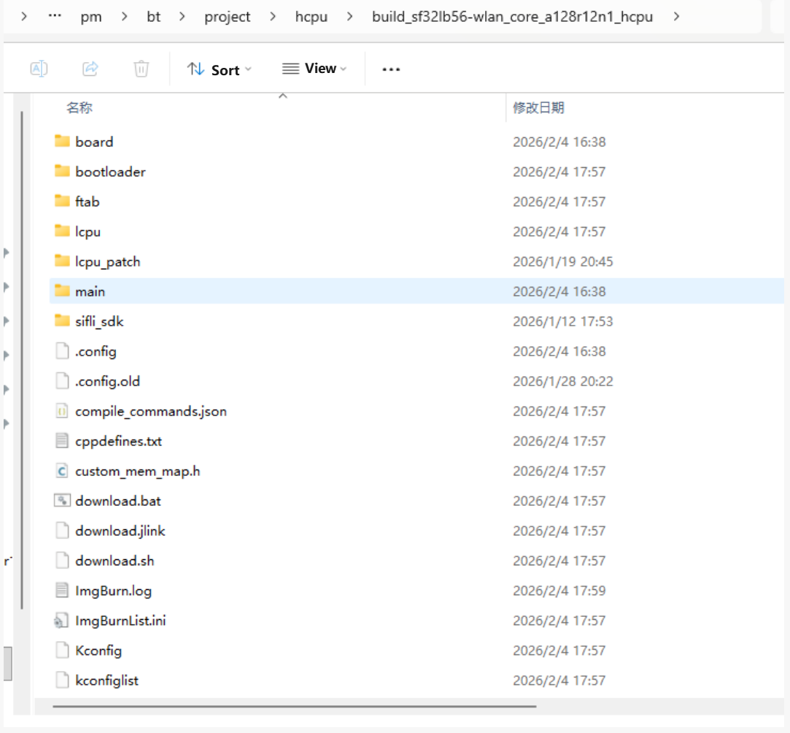

# Build and Flash the Example
## Build
If you already have a prebuilt image, skip to the flashing section to start testing.
Go to `example\pm\bt\project\hcpu`.
If your board is `sf32lb56-wlan_core_a128r12n1`, build with:
```
scons --board=sf32lb56-wlan_core_a128r12n1 -j8 
```
If your board is `sf32lb56-wlan_core_n16r12n1`, build with:
```
scons --board=sf32lb56-wlan_core_n16r12n1 -j8 
```

For `sf32lb56-wlan_core_a128r12n1`, the built image is stored under the `build` directory.



The default TX power is 0 dBm. To test power at 10 dBm, run the following in the HCPU project directory:
```
menuconfig --board=sf32lb56-wlan_core_a128r12n1
```
Open the menuconfig UI, set the three values shown to 10, save and exit, then build a new image.


## Flash the Image
In the build directory, run:
```
build_sf32lb56-wlan_core_a128r12n1_hcpu\uart_download.bat
```
This flashes the image built under `build`.