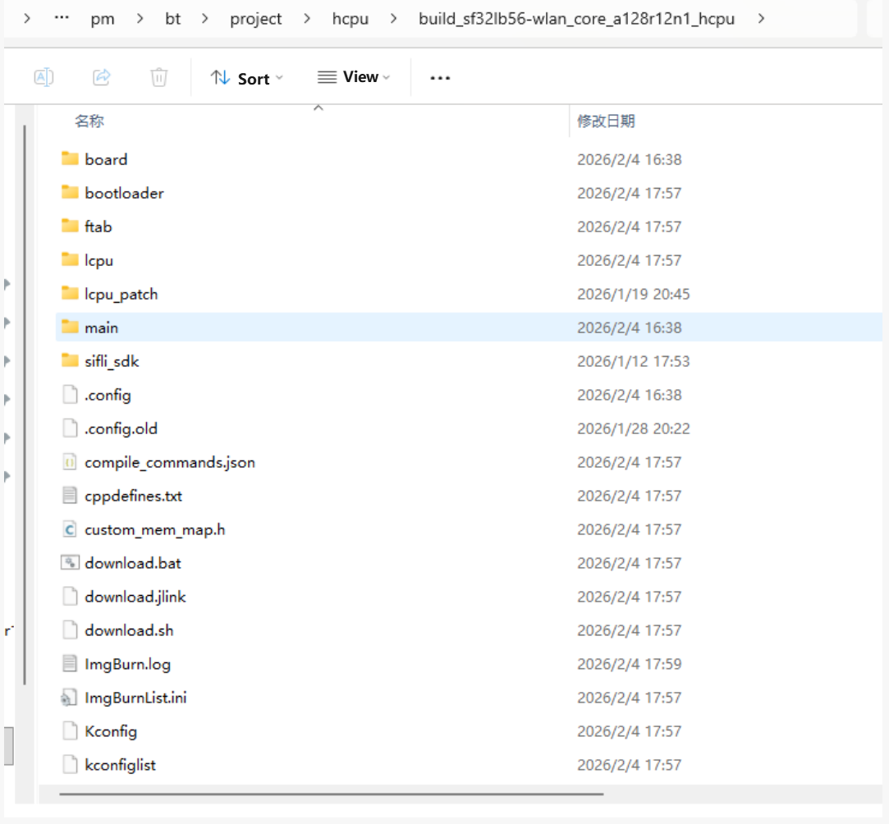

# Build and Flash
## Build
If you already have a compiled image file, you can skip to the flashing section to start testing.
Go to `example\pm\coremark\project\hcpu`.
If your board model is `sf32lb56-wlan-core_a128r12n1`, build with:
```
scons --board=sf32lb56-wlan-core_a128r12n1 -j8 
```
If your board model is `sf32lb56-wlan-core_n16r12n1`, build with:
```
scons --board=sf32lb56-wlan-core_n16r12n1 -j8 
```

Using `sf32lb56-wlan-core_a128r12n1` as an example, the compiled image is saved under the `build` directory.




## Flash Image
In the build output directory, run:
```
build_sf32lb56-wlan-core_a128r12n1_hcpu\uart_download.bat
```
Flash the compiled image from the `build` directory.

## Transmit Power Configuration
The project is configured with a default transmit power of 0 dBm. Use the command `ble_tx_pwr_save x` to adjust transmit power, where x represents the target power value in dBm.Example: To set transmit power to 10 dBm, run `ble_tx_pwr_save 10`.The device will automatically reboot for the setting to take effect after modification.