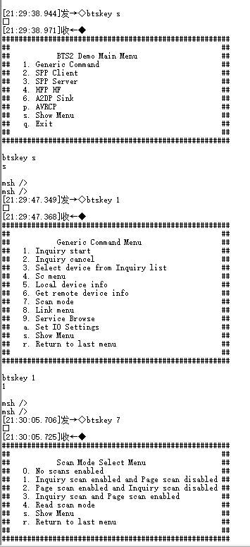

# Scan
1. Open the serial terminal and connect to the HCPU console. Connect the measurement device and the module under test.
2. Keep the wake-up pin low, power-cycle the board, and after startup you should see logs like the figure below.


3. After startup, ADV, Inquiry Scan, and Page Scan are enabled. To measure Scan power, disable ADV first with:
```
diss adv_stop
```
4. The system defaults to the BTS main menu at boot. Use `btskey` commands to enable/disable Scan. Send `btskey s` to show the current menu, then follow prompts to enter submenus. For example, in the main menu, send the following three commands to enable Page Scan and disable Inquiry Scan:
```
(a) btskey 1
(b) btskey 7
(c) btskey 2
```



5. Configure the device via BTS commands to enable only Inquiry Scan or only Page Scan, then set the wake-up pin high so the system enters low-power mode. Measure the 1-minute average current (Scan average current `C1`) and the baseline current between two peaks (sleep current `C2`). The incremental current is `C = C1 − C2`. The test program uses a Page Scan period of 1.28 s and an Inquiry Scan period of 2.56 s, so Inquiry Scan’s incremental current is half of Page Scan’s.

6. Set the wake-up pin low, use BTS commands to enable both Inquiry Scan and Page Scan, then set the wake-up pin high to enter low-power mode. Measure the average current and record it as the Both Scan current.