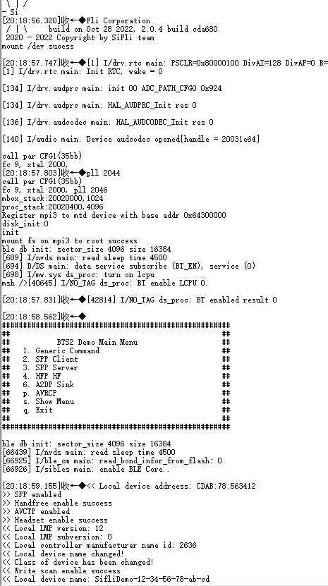
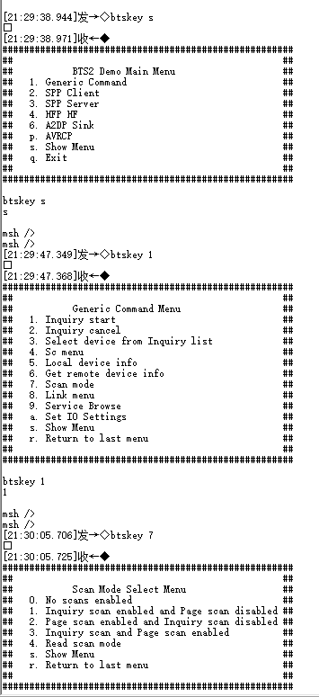

# Scan
1. Open the serial terminal and connect to the HCPU console. Connect the measurement device and the module under test.
2. Keep the wake-up pin low, power-cycle the board, and after startup you should see logs like the figure below.


3. After startup, ADV, Inquiry Scan, and Page Scan are enabled. To measure Scan power, disable ADV first with:
```
diss adv_stop
```
4. The system defaults to the BTS main menu at boot. Use `btskey` commands to enable/disable Scan. Send `btskey s` to show the current menu, then follow prompts to enter submenus. For example, in the main menu, send the following three commands to enable Page Scan and disable Inquiry Scan:
```
(a) btskey 1
(b) btskey 7
(c) btskey 2
```



5. * Use BTS commands to configure the device to transmit only Inquiry Scan or Page Scan. Set the wake-up pin high, and the system will enter low-power mode.

Select the scan activity current within one cycle, measure the active duration At and the average current AC, then measure the sleep duration St within the same cycle and the sleep average current Sc. Substitute these values into the following formula to calculate the average current consumption of Inquiry Scan or Page Scan.
Formula: Average current = (Ac * 1000 * At + Sc * St)/(At + St)

<div align="center"><strong> Select period</strong></div>

The Page Scan period in the test program is 1.28 seconds, and the Inquiry Scan period is 2.56 seconds, so the incremental current of Inquiry Scan is half that of Page Scan.

6. * Set the wake-up pin low, use BTS commands to configure the device to transmit both Inquiry Scan and Page Scan, then set the wake-up pin high and let the system enter low-power mode. Measure the average current over one minute as C1 for both scan, then measure the baseline current between the two peaks as the sleep current C2. The incremental current of both scan is C = C1 - C2.