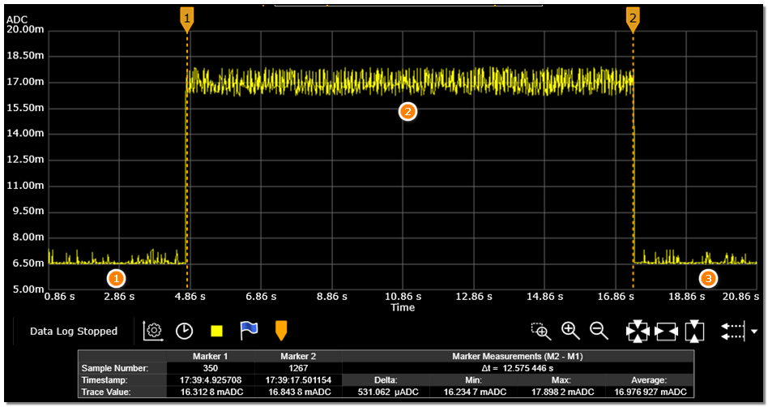

# CoreMark

## HPSYS
1. Open the serial terminal and connect to the HCPU and LCPU consoles. Connect the measurement device and the module under test.
2. Reset. After a successful boot, the HCPU console prints logs as shown below.

```{figure} assert/image4.png
:width: 60%
:align: center
```
3. Send `lcpu on` to set LCPU into WFI mode. After LCPU starts, logs appear as below.
```{figure} assert/image9.png
:width: 70%
:align: center
```
4. Send `run_coremark 240` to measure average current `C1`, then `run_coremark 192` to measure `C2`. The incremental current per MHz between 240 MHz and 192 MHz is `C = (C1 − C2) / (240 − 192)`.

5. As shown, Phase 1 is the current waveform in WFI at 192 MHz. After starting CoreMark (Phase 2), the current rises and remains until the test ends. Phase 3 shows the return to WFI.


## LPSYS
1. Open the serial terminal and connect to both HCPU and LCPU consoles. Connect the measurement device and the module under test.
2. In the HCPU console, send `lcpu on` to set LCPU into WFI mode. After LCPU starts, logs appear as below.
```{figure} assert/image9.png
:width: 70%
:align: center
```
3. Set the wake-up pin high to put HPSYS into low-power mode.
4. In the LCPU console, send `run_coremark 48` to run CoreMark at 48 MHz and measure average current `C1`.
5. Send `run_coremark 24` to run at 24 MHz and measure average current `C2`. The per-MHz current increment is `C = (C1 − C2) / (48 − 24)`.