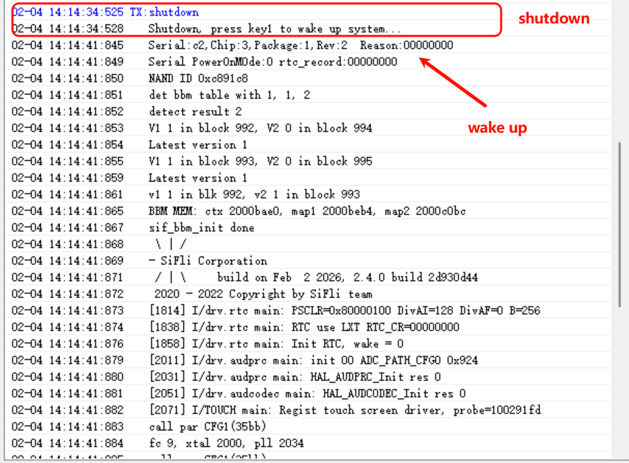

# Shutdown
1. Open the serial terminal and connect to the HCPU console.
2. Reset. After a successful boot, send `shutdown` in the HCPU console to power off the system. In shutdown, only the wake-up pin can wake it. Since shutdown current is very small, use a multimeter for measurement.
3. Set the wake-up pin high then float it to wake the system. The console prints the boot-stage logs again, but the version log does not appear.

4. Send `shutdown 5` to power off and automatically boot after 5 seconds, as shown below. You can extend the wait time to facilitate measurement.

