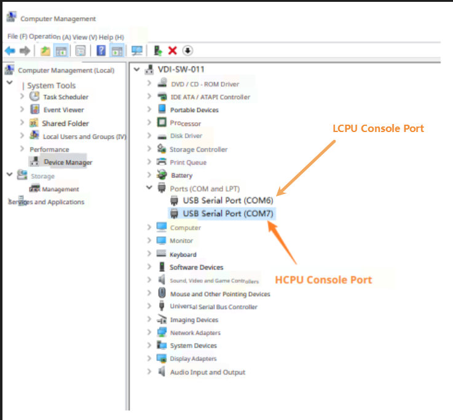
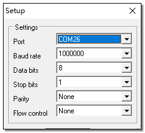

# Testing Instructions
The CoreMark example measures power in the following scenarios:
* One core runs the CoreMark benchmark.
* One core runs a while loop for a period of time executing `nop`.
* System shutdown with RTC scheduled wake-up.
* System shutdown with wake-up pin.

To control test conditions, use PA52 as the HCPU wake-up pin. When the wake-up pin is not high, HCPU cannot enter low-power mode and can process console commands. When the wake-up pin is high (1.8 V unless otherwise noted), HCPU enters low-power mode and cannot respond to console commands.

LCPU does not enter low-power mode automatically. If LCPU is started, when it is not executing tasks it stays in WFI state and can respond to console commands. If LCPU is not started, it is considered to be in halt and cannot process console commands.

Note: All commands must end with carriage return and newline (CRLF).

After connecting the PC and the board with a USB Type‑C cable, two serial ports will appear, serving as the consoles for HCPU and LCPU, as shown below.

Serial settings: set the baud rate to 1,000,000 for both ports.

For non-shutdown scenarios, when one core executes the specified task, the other core should enter the following state to ensure accurate measurements:
* When HCPU executes the task, LCPU should be in WFI state (send `lcpu on` on the HCPU console).
* When LCPU executes the task, HCPU should enter Standby low-power mode (wake-up pin set high).

HCPU commands to start tasks:
* `run_coremark <freq_mhz>`: set the frequency (MHz) and run CoreMark.
	Example: `run_coremark 48` runs CoreMark at 48 MHz.
* `run_while_loop <freq_mhz>`: set the frequency (MHz) and run a while loop for a period.
	Example: `run_while_loop 48` runs the while loop at 48 MHz.

Additional HCPU commands:
* `lcpu on`: start LCPU. After start, LCPU can receive console commands and run tasks.
* `shutdown[<wakeup_time_sec>]`: shutdown. Optional parameter in seconds determines automatic power-on after shutdown; without parameter, only the wake-up pin can wake the system.

Note: With Ofast optimization level, benchmark scores are for reference and may not reach the highest scores achievable with Omax.