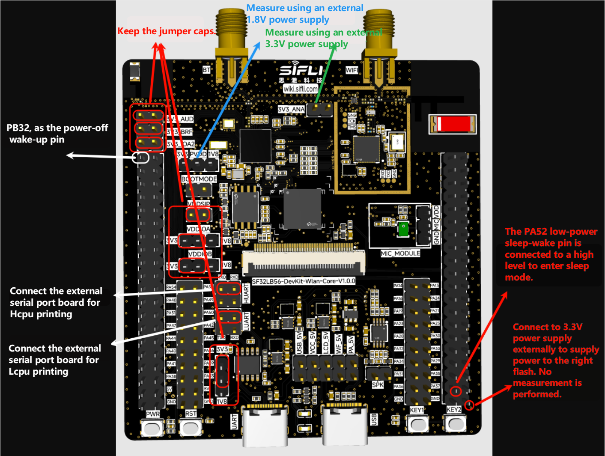

# Power Measurement Method
Use power measurement instruments to supply 1.8 V to PVDD and 3.3 V to 3V3_ANA. The supply pins and jumper settings are highlighted in the figure. TXD and RXD connect to external USB‑UART boards to input commands (two UART boards are required, one for the HCPU and one for the LCPU). The two wake-up pins PB32 and PA52 can be temporarily connected with jumper wires without fixed levels for later use in testing.

