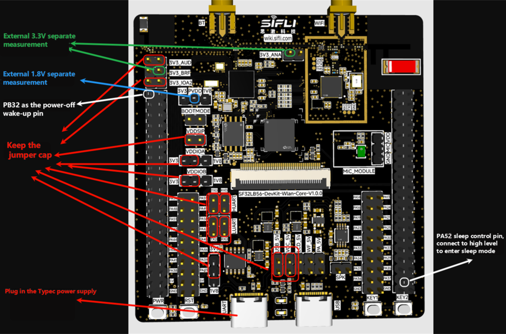

# Power Measurement Method
Use a power measurement instrument to supply PVDD with 1.8 V and supply 3V3_ANA + 3V3_BRF with 3.3 V. The supply pins and jumper shunts are highlighted in the figure. The two wake pins, PB32 and PA52, can be temporarily connected with Dupont wires but left unconnected so their levels can be set later during testing.

