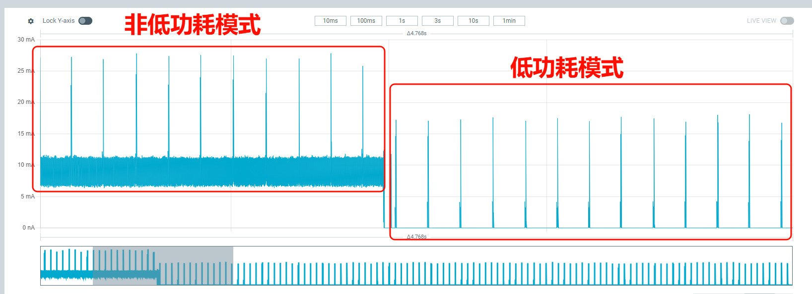
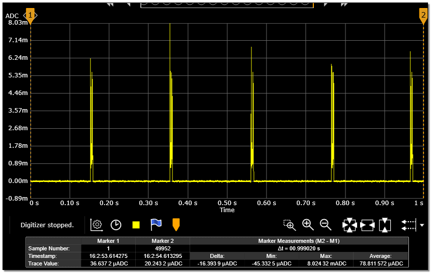

# ADV场景
1. * 打开串口调试工具，连接 HCPU 的 console 串口，连接测量设备与被测模块
2. * 板子启动成功后出现如图[下图](adv_log)的 log (此时唤醒引脚应保持悬空或者低电平，否则开机就会进入休眠)

```{image} assert/image5.png
:name: adv_log
```

3. * 启动后默认的 ADV 周期为 200ms，由于 Inquiry Scan 和 Page Scan 也会自动打开，为测试 BLE 的功耗，需要使用 btskey 命令关闭 Scan，关闭命令参考经典蓝牙的Scan部分。例如，先发送 btskey s 命令，如果显示当前位于主菜单，就可以依次发送以下三个命令关闭 Page Scan 和 Inquiry Scan。发送完 btskey0，可以再发送 btskey 4 查询 Scan 的状态。
```
(a) btskey 1
(b) btskey 7
(c) btskey 0
```
4. * 将唤醒 PIN 接高电平，系统进入低功耗模式，电流值如下图明显的下降，测量 200ms 间隔时的电流，低功耗模式下的电流波形见ADV=200ms 的电流波形图，记 10 秒的平均电流为 C1, 两个峰之间的电流记为睡眠电流 C2，ADV 的增量电流 C=C1-C2

<div align="center"><strong>进入低功耗模式电流变化</strong></div>


<div align="center"><strong>ADV=200ms 的电流波形</strong></div>

5. * 将唤醒 PIN 接低电平，系统退出低功耗模式，在 console 里发送命令ble_config adv 500，将 ADV 间隔改为 500ms
6. * 将唤醒 PIN 接高电平，系统再次进入低功耗模式，测量 500ms 间隔时的电流

重复步骤5和6，可以测量ADV间隔为50ms、100ms、500ms和1000ms 时的电流。