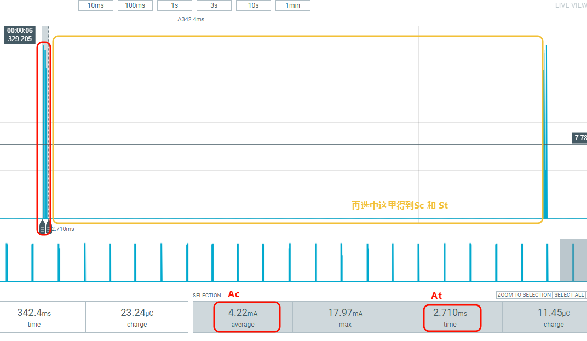

# 连接场景
1. * 打开串口调试工具，连接 HCPU 的 console 串口，连接测量设备与被测模块
2. * 唤醒 PIN 接低电平，开发板重新上电复位成功后出现如下图的 log。类似ADV章节量 ADV 电流，也需要关闭 BT Scan

```{figure} assert/image8.png
:width: 50%
:align: center
```

3. * 在手机上打开如下图的 LightBlue 软件，在 Scan 列表找到名为 SIFLI_APP 的设备，点击 CONNECT 连接设备

```{figure} assert/image9.png
:width: 40%
:align: center
```

4. * 连接成功后 BLE 进入连接状态，默认的连接周期为 15ms

5. * 将唤醒 PIN 接低电平，系统退出低功耗模式，在 console 里发送命令ble_config conn 50，将连接周期改为 50ms，确认 console 出现如下图打印，其中Updated connection interval：40表示 1.25ms 单位的连接间隔，40×1.25=50ms，如果未出现打印，则表示参数更新失败，需要再次发送命令，同时观察电流波形确认间隔是否更新成功

```{figure} assert/image10.png
:width: 70%
:align: center
```

6. * 将唤醒 PIN 接高电平，系统进入低功耗模式，与 ADV 电流类似，挑选一个周期内的工作电流选中，得到一次工作的持续时间 At 与平均电流 AC，再得到当前周期内的休眠时间持续 St 与休眠平均电流 Sc，代入如下公式计算可得出平均电流消耗。
计算公式：平均电流 = (Ac * 1000 * At + Sc * St)/(At + St)

<div align="center"><strong> 选择周期</strong></div>

重复步骤 5 和 6，可以测量连接周期为50ms、100ms、200ms、500ms和1000ms时的电流。
