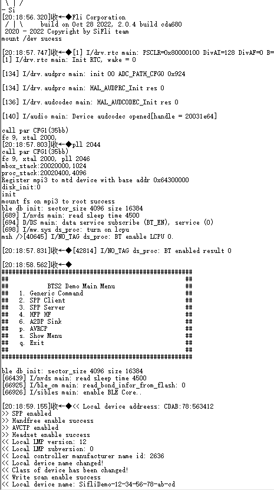

# Scan
1. * 打开串口调试工具，连接 HCPU的 console串口，连接测量设备与被测模块
2. * 唤醒 PIN接低电平，重新上电复位开发板，启动成功后出现如下图的 log


3. * 启动后 ADV、Inquiry Scan和 Page Scan都会打开，为测试 Scan的功耗，需先关闭 ADV，关闭命令为
```
diss adv_stop
```
4. * 开机后默认处于 BTS主菜单，通过发送 btskey命令可以配置打开或关闭 Scan。发送btskey s命令显示当前菜单，再按菜单提示发送命令进入子菜单。比如，在主菜单下，依次发送如下三个命令可以打开 Page Scan并关闭 Inquiry Scan
```
(a) btskey 1
(b) btskey 7
(c) btskey 2
```


5. * 发送 BTS命令配置设备只发送 Inquiry Scan或者 Page Scan，唤醒 PIN接高电平，系统进入低功耗模式，测量 1分钟的平均电流，记为 Scan的平均电流 C1，同时再测量两个峰之间的底电流，记为睡眠电流 C2，Scan的增量电流即为 C=C1-C2。测试程序的 Page Scan周期为 1.28秒，Inquiry Scan周期为 2.56秒，所以Inquiry Scan的增量电流为 Page Scan的一半。

6. * 唤醒 PIN 接低电平，发送 BTS 命令配置设备同时发送 Inquiry Scan 和 Page Scan，再把唤醒 PIN 接高电平，系统进入低功耗模式，测量测试的平均电流，记为 Both Scan 的电流