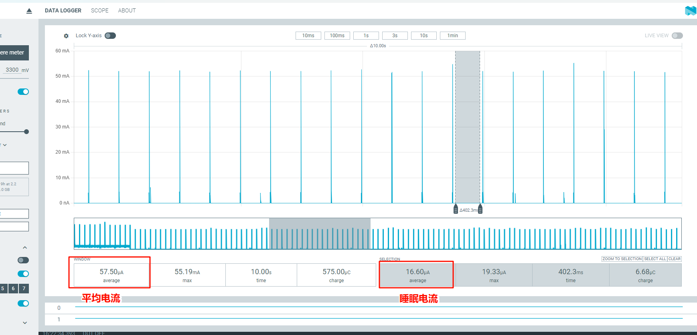

# Sniff Mode
1. * 参考Scan章节的步骤复位开发板并关闭 ADV
2. * 手机连接开发板对应的蓝牙设备，点击后弹出配对窗口，点确认后配对成功，蓝牙设备进入已配对设备列表，并显示已连接状态,如下图：
::::{grid} 1 1 2 2
:gutter: 2

:::{grid-item}
```{figure} assert/image7.png
:width: 60%
:align: center

```
:::

:::{grid-item}
```{figure} assert/image8.png
:width: 60%
:align: center

```
:::

::::

3. * 连接完成后，等待一会儿，console 窗口会打印 »Sniff mode，表示设备已进入 Sniff 模式
4. * 发送 btskey 命令关闭 Scan，具体步骤如下：
```
(a) btskey s: 查看当前菜单
(b) 如果是 HFP HP Menu，则发送
(c) btskey r：返回上一级菜单 BTS2 Demo Main Menu，再顺序发送以下命令
(d) btskey 1: 选择 Generic Command
(e) btskey 7: 选择 Scan mode
(f) btskey 0: 关闭 scan
```
5. * 与 Scan 电流的测量方法类似，挑选一个周期内的sniff工作电流选中，得到一次工作的持续时间 At 与平均电流 AC，再得到当前周期内的休眠时间持续 St 与休眠平均电流 Sc，代入如下公式计算可得出sniff平均电流消耗。
计算公式：平均电流 = (Ac * 1000 * At + Sc * St)/(At + St)

<div align="center"><strong> 选择周期</strong></div>


6. * Sniff 模式的间隔与 attemp 次数与手机有关，本次测试中使用 一加ace 6，attemp 次数为4。