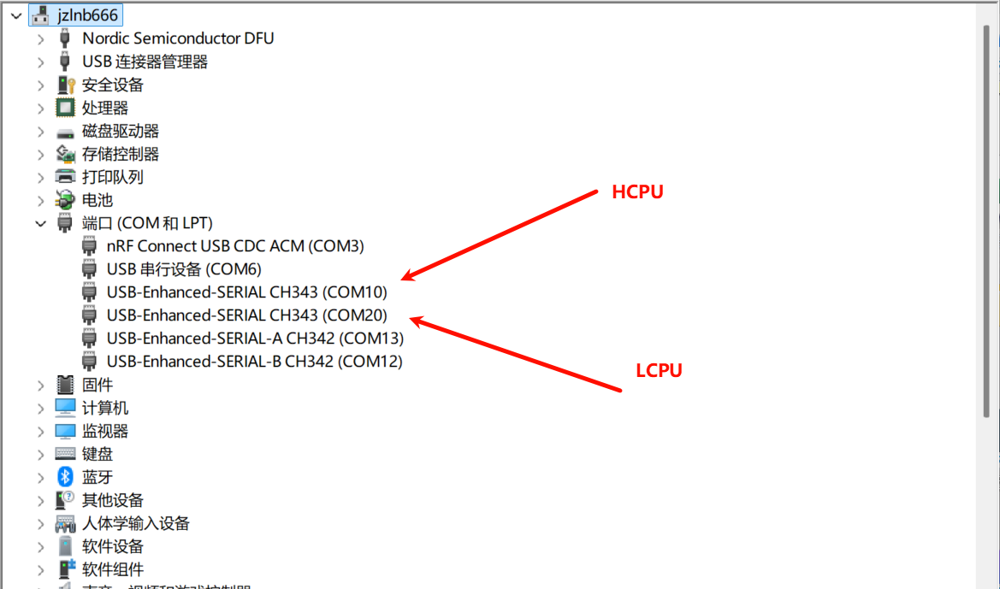

# 测试说明
使用 BT 例程可以测试 Scan 和 Sniff 模式的功耗（发射功率0dBm），系统上电后测试例程自动开启 Scan 和 ADV，使用手机连接蓝牙设备，在 HCPU 的 console 里可以发送命令修改配置，发送的命令都需以回车换行结尾。

PC 与调试板使用 USB Type-C 线连接后会枚举出两个串口，分别作为HCPU以及LCPU的console，如下图所示。

串口设置参见下图，波特率均设置为 1000000。

为便于控制测试条件，使用PA52作为HCPU的唤醒PIN。当唤醒PIN不为高电平时HCPU无法进人低功耗模式，此时可以通过console给HCPU发送命令执行指定任务，当唤醒PIN接高电平（即1.8V电压，下文如未特别说明，高电平均指1.8V电压）时，HCPU进人低功耗模式，此时HCPU无法响应console命令。

测试例程LCPU的主频为24MHz，HCPU与LCPU使用的低功耗模式为Standby模式。
HCPU使用btskey命令操作菜单修改配置。
