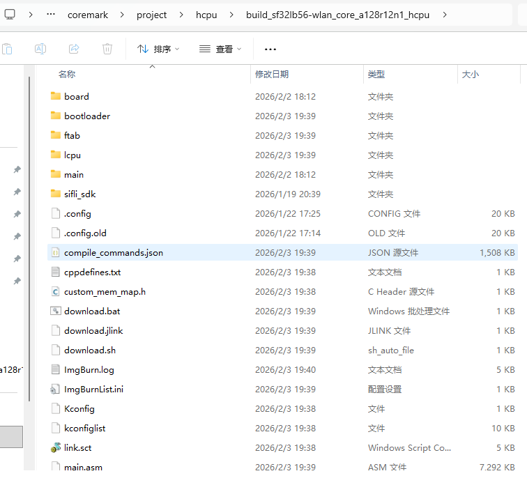

# 例程编译与烧录
## 编译
如果使用已编译好的 image 文件，可以直接跳到烧录部分进行烧录开始测试。
进入example\pm\coremark\project\hcpu目录
如果使用的开发板型号为 `sf32lb56-wlan_core_a128r12n1`,就使用如下命令进行编译
```
scons --board=sf32lb56-wlan_core_a128r12n1 -j8 
```
如果使用的开发板型号为 `sf32lb56-wlan_core_n16r12n1`,就使用如下命令进行编译
```
scons --board=sf32lb56-wlan_core_n16r12n1 -j8 
```

以`sf32lb56-wlan_core_a128r12n1`为例，编译生成的 image文件保存在 build 目录下。



## 烧录镜像
在命令行编译的目录下执行
```
build_sf32lb56-wlan_core_a128r12n1_hcpu\uart_download.bat
```
烧写 build 目录下编译生成的镜像文件。